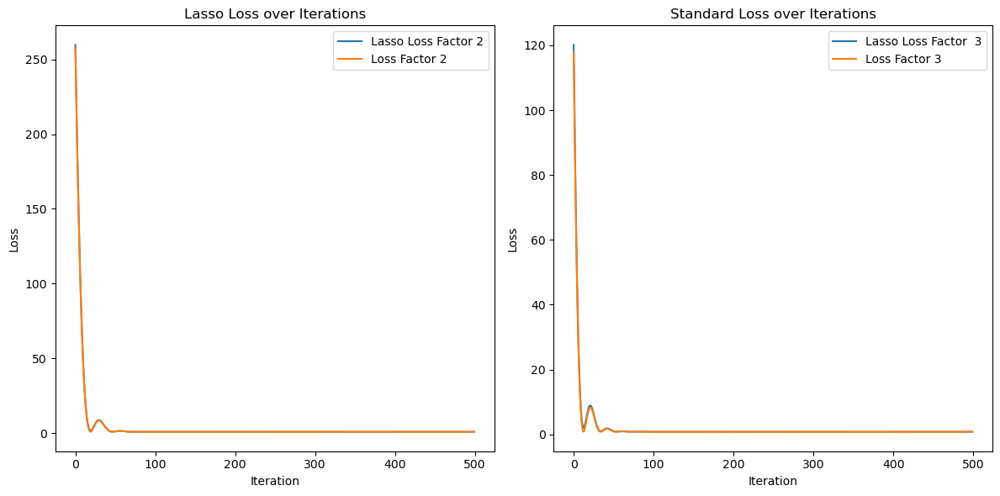
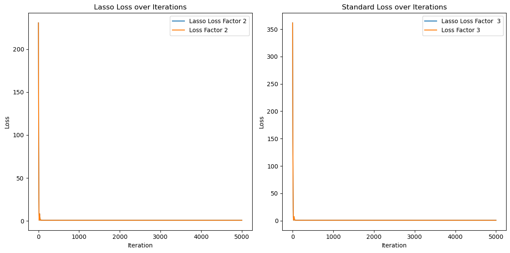
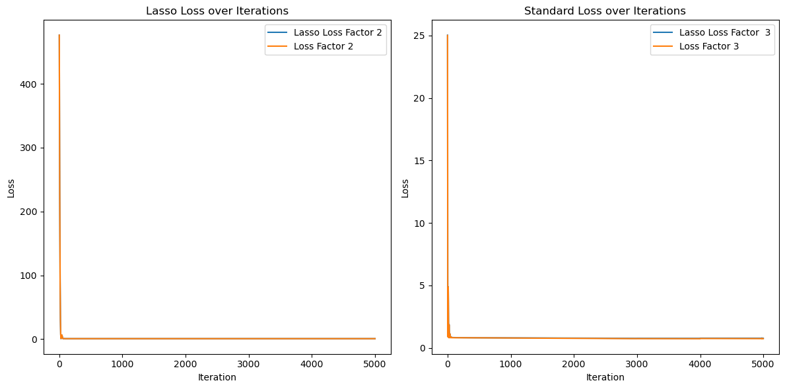

```python
## Define functions (utils.py)
```


```python
import pandas as pd
import glob
import os
import torch
import torch.nn as nn
import torch.optim as optim
import torch.nn.functional as F
import argparse
import matplotlib.pyplot as plt
import numpy as np
from sklearn.preprocessing import LabelEncoder
from sklearn.model_selection import train_test_split
from sklearn.model_selection import KFold
from datetime import datetime

def preprocess_data(file_path):
    path = "DATA_1"
    csv_files = glob.glob(os.path.join(path, "*.csv"))
    dfs = []
    for file in csv_files:
        try:
            df = pd.read_csv(file)
            if not df.empty:
                # Rename the first column
                first_column_name = df.columns[0]
                df = df.rename(columns={first_column_name: 'userid'})
                dfs.append(df)
            else:
                print(f"File {file} is empty.")

        except Exception as e:
            print(f"Error reading {file}: {e}")

    # Verify all DataFrames are read correctly
    if not dfs:
        print("No DataFrames to merge.")
    else:
        # Assuming 'common_column_name' is the common column used for merging
        common_column = 'userid'  # This should match the renamed first column

        # Merge DataFrames iteratively
        merged_df = dfs[0]
        for df in dfs[1:]:
            if common_column in merged_df.columns and common_column in df.columns:
                merged_df = pd.merge(merged_df, df, on=common_column)
            else:
                print(f"Common column '{common_column}' not found in one of the DataFrames.")
                break

    return merged_df


def dataframe_to_tensor_with_missing(df, target_column):
    # Initialize LabelEncoder for string columns
    label_encoders = {}
    
    # Create a dictionary to store tensor parts
    tensor_parts = {}

    # Exclude target column from features
    features = df.drop(["Factor2","Factor3"], axis=1)

    for column in features.columns:
        if pd.api.types.is_numeric_dtype(features[column]):
            # Fill missing values with mean or any strategy you prefer
            features[column] = features[column].fillna(features[column].mean())
            if not features[column].isnull().all():
                tensor_parts[column] = torch.tensor(features[column].values, dtype=torch.float32)
        
        elif pd.api.types.is_string_dtype(features[column]) or features[column].dtype == 'object':
            # Fill missing values with a placeholder, e.g., 'missing'
            features[column] = features[column].fillna('missing')
            le = LabelEncoder()
            if not features[column].isnull().all():
                tensor_parts[column] = torch.tensor(le.fit_transform(features[column].values), dtype=torch.float32)
                label_encoders[column] = le
        
        elif pd.api.types.is_datetime64_any_dtype(features[column]):
            # Fill missing datetime values with a placeholder or strategy
            features[column] = features[column].fillna(pd.Timestamp('1970-01-01'))
            if not features[column].isnull().all():
                tensor_parts[column] = torch.tensor(features[column].values.astype(np.int64) // 10**9, dtype=torch.float32)
        
        else:
            raise ValueError(f"Unsupported column type: {features[column].dtype} in column {column}")

    # Check if any tensors were created
    if not tensor_parts:
        raise ValueError("No valid columns found for conversion to tensors.")

    # Stack tensors along the second dimension (i.e., columns)
    tensors = torch.stack([tensor_parts[col] for col in features.columns if col in tensor_parts], dim=1)

    # Get target variable tensor
    target_tensor = torch.tensor(df[target_column].values, dtype=torch.float32)

    return tensors, target_tensor, label_encoders


def augment_data(X, Y, num_augmentations=5, noise_std=0.1):
    augmented_X = []
    augmented_Y = []
    
    for _ in range(num_augmentations):
        noise = torch.normal(mean=0, std=noise_std, size=X.shape)
        augmented_X.append(X + noise)
        augmented_Y.append(Y + noise[:, :Y.shape[1]])  
    
    # Stack augmented data with the original data
    augmented_X = torch.cat([X] + augmented_X, dim=0)
    augmented_Y = torch.cat([Y] + augmented_Y, dim=0)
    
    return augmented_X, augmented_Y


class SimpleRegressionModel(torch.nn.Module):
    def __init__(self, input_dim, output_dim):
        super(SimpleRegressionModel, self).__init__()
        self.linear = torch.nn.Linear(input_dim, output_dim)
        
    def forward(self, x):
        return self.linear(x)


class LassoLoss(torch.nn.Module):
    def __init__(self, model, alpha=1.0):
        super(LassoLoss, self).__init__()
        self.model = model
        self.alpha = alpha
        self.mse_loss = torch.nn.MSELoss()

    def forward(self, outputs, targets):
        mse_1 = self.mse_loss(outputs[:,0], targets[:,0])
        l1_penalty_1 = sum(param.abs().sum() for param in self.model.parameters())
        loss_1 = mse_1 + self.alpha * l1_penalty_1
        mse_2 = self.mse_loss(outputs[:,1], targets[:,1])
        l1_penalty_2 = sum(param.abs().sum() for param in self.model.parameters())
        loss_2 = mse_2 + self.alpha * l1_penalty_2
        return loss_1, loss_2,


def compute_weighted_loss(outputs, targets, age_groups, worst_group, alpha_worst_group):
    criterion = nn.MSELoss()
    group_indices = (age_groups == worst_group).nonzero(as_tuple=True)[0]
    group_outputs = outputs[group_indices]
    group_targets = targets[group_indices]
    loss_1 = criterion(group_outputs[:, 0], group_targets[:, 0]) * alpha_worst_group
    loss_2 = criterion(group_outputs[:, 1], group_targets[:, 1]) * alpha_worst_group
    return loss_1, loss_2

def train_and_evaluate_aug_worst(X, Y, age_groups, k=5, num_augmentations=5, noise_std=0.1, alpha_values=[0.001, 0.01, 0.1, 1.0, 10.0], epochs=1000, use_augmentation=True, use_worst_group=True, alpha_worst_group_values=[0.01, 1.0]):
    if use_augmentation:
        # Augment the data
        X_augmented, Y_augmented = augment_data(X, Y, num_augmentations, noise_std)
        age_groups_augmented = torch.cat([age_groups for _ in range(X_augmented.shape[0] // X.shape[0])])
    else:
        X_augmented, Y_augmented, age_groups_augmented = X, Y, age_groups

    # Outer K-Fold Cross-Validation
    outer_kf = KFold(n_splits=k, shuffle=True, random_state=42)
    
    best_alpha = None
    best_val_loss = float('inf')
    alpha_losses = []

    for train_index, val_index in outer_kf.split(X_augmented):
        X_train_fold, X_val_fold = X_augmented[train_index], X_augmented[val_index]
        Y_train_fold, Y_val_fold = Y_augmented[train_index], Y_augmented[val_index]
        age_groups_train_fold, age_groups_val_fold = age_groups_augmented[train_index], age_groups_augmented[val_index]

        # Inner K-Fold Cross-Validation to select the best alpha 
        for alpha in alpha_values:
            inner_kf = KFold(n_splits=3, shuffle=True, random_state=42)
            inner_losses = []
            
            for inner_train_index, inner_val_index in inner_kf.split(X_train_fold):
                X_inner_train, X_inner_val = X_train_fold[inner_train_index], X_train_fold[inner_val_index]
                Y_inner_train, Y_inner_val = Y_train_fold[inner_train_index], Y_train_fold[inner_val_index]
                age_groups_inner_train, age_groups_inner_val = age_groups_train_fold[inner_train_index], age_groups_train_fold[inner_val_index]
                
                model = SimpleRegressionModel(X.shape[1], Y.shape[1])
                optimizer = optim.Adam(model.parameters(), lr=0.001)
                lasso_loss = LassoLoss(model, alpha=alpha)
                criterion = nn.MSELoss()

                # Calculate standard Lasso loss
                for epoch in range(epochs):
                    model.train()
                    optimizer.zero_grad()
                    outputs = model(X_inner_train)
                    loss_1, loss_2 = lasso_loss(outputs, Y_inner_train)
                    total_loss = (loss_1 + loss_2) * 0.5
                    total_loss.backward()
                    optimizer.step()

                # Evaluate on validation
                model.eval()
                with torch.no_grad():
                    val_outputs = model(X_inner_val)
                    val_loss_1, val_loss_2 = lasso_loss(val_outputs, Y_inner_val)
                    inner_losses.append((val_loss_1.item() + val_loss_2.item()) / 2)

            # Calculate mean of loss in the inner fold
            avg_inner_loss = np.mean(inner_losses)
            alpha_losses.append((alpha, avg_inner_loss))
        
        avg_losses = {alpha: [] for alpha in alpha_values}
        for alpha, loss in alpha_losses:
            avg_losses[alpha].append(loss)
        
        for alpha in alpha_values:
            avg_val_loss = np.mean(avg_losses[alpha])
            print(f'Alpha: {alpha}, Avg Validation Loss: {avg_val_loss:.4f}')
            if avg_val_loss < best_val_loss:
                best_val_loss = avg_val_loss
                best_alpha = alpha
    
    print(f'Best Alpha: {best_alpha}, Best Validation Loss: {best_val_loss:.4f}')
    
    final_model = SimpleRegressionModel(X_augmented.shape[1], Y_augmented.shape[1])
    final_lasso_loss = LassoLoss(final_model, alpha=best_alpha)
    final_optimizer = optim.Adam(final_model.parameters(), lr=0.001)

    train_loss = {
        'loss_lasso_1_train': [],
        'loss_lasso_2_train': [],
        'loss_1_train': [],
        'loss_2_train': []
            }

    losses = {
        'factor_2_without_lasso': [],
        'factor_3_without_lasso': [],
        'factor_2_with_lasso': [],
        'factor_3_with_lasso': []
    }

    # Train the model (outer fold) using the best alpha)
    for train_index, val_index in outer_kf.split(X_augmented):
        X_train_fold, X_val_fold = X_augmented[train_index], X_augmented[val_index]
        Y_train_fold, Y_val_fold = Y_augmented[train_index], Y_augmented[val_index]
        age_groups_train_fold, age_groups_val_fold = age_groups_augmented[train_index], age_groups_augmented[val_index]
    
        for epoch in range(epochs):
            final_model.train()
            final_optimizer.zero_grad()
            outputs = final_model(X_train_fold)
            loss_lasso_1, loss_lasso_2 = final_lasso_loss(outputs, Y_train_fold)
            loss_1 = criterion(outputs[:, 0], Y_train_fold[:, 0]).item()
            loss_2 = criterion(outputs[:, 1], Y_train_fold[:, 1]).item()

            # Calculate weighted loss (if worst-group accuracy is applied)
            if use_worst_group:
                with torch.no_grad():
                    worst_group_loss = float('-inf')
                    worst_group = None
                    for group in torch.unique(age_groups_train_fold):
                        group_indices = (age_groups_train_fold == group).nonzero(as_tuple=True)[0]
                        group_X = X_train_fold[group_indices]
                        group_Y = Y_train_fold[group_indices]
                        group_outputs = final_model(group_X)
                        group_loss_1 = criterion(group_outputs[:, 0], group_Y[:, 0]).item()
                        group_loss_2 = criterion(group_outputs[:, 1], group_Y[:, 1]).item()
                        group_loss = max(group_loss_1, group_loss_2)
                        if group_loss > worst_group_loss:
                            worst_group_loss = group_loss
                            worst_group = group.item()

                best_worst_group_alpha = None
                best_worst_group_loss = float('inf')
                
                for alpha_worst_group in alpha_worst_group_values:
                    loss_weighted_1, loss_weighted_2 = compute_weighted_loss(outputs, Y_train_fold, age_groups_train_fold, worst_group, alpha_worst_group)
                    total_loss = (loss_lasso_1 + loss_lasso_2) * 0.5 + (loss_weighted_1 + loss_weighted_2) * 0.5
                    
                    if total_loss.item() < best_worst_group_loss:
                        best_worst_group_loss = total_loss.item()
                        best_worst_group_alpha = alpha_worst_group
                
                loss_weighted_1, loss_weighted_2 = compute_weighted_loss(outputs, Y_train_fold, age_groups_train_fold, worst_group, best_worst_group_alpha)
                total_loss = (loss_lasso_1 + loss_lasso_2) * 0.5 + (loss_weighted_1 + loss_weighted_2) * 0.5
                
            else:
                total_loss = (loss_lasso_1 + loss_lasso_2) * 0.5
            
            total_loss.backward()
            final_optimizer.step()

            # Append the losses to the lists
            train_loss['loss_lasso_1_train'].append(loss_lasso_1.detach().cpu().numpy())
            train_loss['loss_1_train'].append(loss_1)
            train_loss['loss_lasso_2_train'].append(loss_lasso_2.detach().cpu().numpy())
            train_loss['loss_2_train'].append(loss_2)

            # Clear gradients explicitly
            final_optimizer.zero_grad()

        # Evaluate on validation for the final model
        final_model.eval()
        with torch.no_grad():
            val_outputs = final_model(X_val_fold)
            loss_without_lasso_1 = nn.MSELoss()(val_outputs[:, 0], Y_val_fold[:, 0]).item()
            loss_without_lasso_2 = nn.MSELoss()(val_outputs[:, 1], Y_val_fold[:, 1]).item()
            loss_with_lasso_1, loss_with_lasso_2 = final_lasso_loss(val_outputs, Y_val_fold)
            
            losses['factor_2_without_lasso'].append(loss_without_lasso_1)
            losses['factor_3_without_lasso'].append(loss_without_lasso_2)
            losses['factor_2_with_lasso'].append(loss_with_lasso_1.item())
            losses['factor_3_with_lasso'].append(loss_with_lasso_2.item())
    
    print("Losses:")
    print(f"Factor 2 without Lasso: {np.mean(losses['factor_2_without_lasso']):.4f}")
    print(f"Factor 3 without Lasso: {np.mean(losses['factor_3_without_lasso']):.4f}")
    print(f"Factor 2 with Lasso: {np.mean(losses['factor_2_with_lasso']):.4f}")
    print(f"Factor 3 with Lasso: {np.mean(losses['factor_3_with_lasso']):.4f}")


    mean_losses = {key: np.mean(value) for key, value in losses.items()}

    # Plot the losses
    plt.figure(figsize=(12, 6))
    plt.ion()
    
    plt.subplot(1, 2, 1)
    plt.plot(train_loss['loss_lasso_1_train'], label='Lasso Loss Factor 2')
    plt.plot(train_loss['loss_1_train'], label='Loss Factor 2')
    plt.xlabel('Iteration')
    plt.ylabel('Loss')
    plt.title('Lasso Loss over Iterations')
    plt.legend()
    
    plt.subplot(1, 2, 2)
    plt.plot(train_loss['loss_lasso_2_train'], label='Lasso Loss Factor  3')
    plt.plot(train_loss['loss_2_train'], label='Loss Factor 3')
    plt.xlabel('Iteration')
    plt.ylabel('Loss')
    plt.title('Standard Loss over Iterations')
    plt.legend()
    
    plt.tight_layout()
    plt.show()

    return mean_losses
```


```python
# Step 1: Data preprocessing
# Define the path to the CSV files
os.chdir('/Users/Zahro002/')  # Update to your actual path
path = 'DATA_1'  
csv_files = glob.glob(os.path.join(path, "*.csv"))
print(csv_files)
df = pd.DataFrame(preprocess_data("DATA_1"))
    
# Fill NA values before adding age groups
df['age'].fillna(-1, inplace=True)
    
# Create age_group based on the age column
df.loc[df['age'] <= 19, 'age_groups'] = 'teenage'
df.loc[df['age'].between(20, 24), 'age_groups'] = 'young_adult'
df.loc[df['age'].between(25, 39), 'age_groups'] = 'adult'
df.loc[df['age'].between(40, 64), 'age_groups'] = 'older_adult'
df.loc[df['age'] > 64, 'age_groups'] = 'seniors'
    
# Convert age groups to categorical codes
age_group_labels = ['teenage', 'young_adult', 'adult', 'older_adult', 'seniors']
df['age_groups'] = pd.Categorical(df['age_groups'], categories=age_group_labels)
age_groups = torch.tensor(df['age_groups'].cat.codes.values, dtype=torch.int64)
df = df.drop(df.loc[:, 'gender':'age_groups'].columns,axis=1)
    
target_column = ["Factor2","Factor3"]
features_tensor, target_tensor, encoders = dataframe_to_tensor_with_missing(df, target_column)

X = features_tensor
Y = target_tensor

# Set a specific seed
torch.manual_seed(123)
    
# Step 2: Add MSE baseline
# Compute the mean of Y_train for both outputs
mean_f2_train = torch.mean(Y[:, 0])
mean_f3_train = torch.mean(Y[:, 1])
    
# Create predictions for the test set
f2_pred = mean_f2_train.repeat(Y.shape[0])
f3_pred = mean_f3_train.repeat(Y.shape[0])
predictions = torch.stack((f2_pred, f3_pred), dim=1)
    
# Calculate MSE for the test set
mse_f2 = F.mse_loss(predictions[:, 0], Y[:, 0])
mse_f3 = F.mse_loss(predictions[:, 1], Y[:, 1])
print(f'Test MSE Baseline (Factor 2): {mse_f2.item():.4f}')
print(f'Test MSE Baseline (Factor 3): {mse_f3.item():.4f}')
results = {'factor_2_without_lasso': [mse_f2.item()], 'factor_3_without_lasso': [mse_f3.item()],'factor_2_with_lasso': [mse_f2.item()], 'factor_3_with_lasso': [mse_f3.item()]}
    
# Step 3: Train and evaluate the models
result_1 = train_and_evaluate_aug_worst(X, Y, age_groups, use_augmentation=False, use_worst_group=False)
result_2 = train_and_evaluate_aug_worst(X, Y, age_groups, use_augmentation=True, use_worst_group=False)
result_3 = train_and_evaluate_aug_worst(X, Y, age_groups, use_augmentation=False, use_worst_group=True)
result_4 = train_and_evaluate_aug_worst(X, Y, age_groups, use_augmentation=True, use_worst_group=True)

# Step 4: Collect the results
df0 = pd.DataFrame(results)
df1 = pd.DataFrame([result_1])
df2 = pd.DataFrame([result_2])
df3 = pd.DataFrame([result_3])
df4 = pd.DataFrame([result_4])
df = pd.concat([df0,df1,df2,df3,df4], ignore_index=True, axis=0)
df.index = ['MSE baseline','Model with K-fold', 'Add data augmentation','Add worst-group accuracy','Add data augmentation and worst-group accuracy']
print(df)

```

    ['DATA_1/lda_600.csv', 'DATA_1/train.csv', 'DATA_1/demog.csv']
    Test MSE Baseline (Factor 2): 0.8245
    Test MSE Baseline (Factor 3): 0.8084
    Alpha: 0.001, Avg Validation Loss: 0.8214
    Alpha: 0.01, Avg Validation Loss: 0.8243
    Alpha: 0.1, Avg Validation Loss: 0.8345
    Alpha: 1.0, Avg Validation Loss: 0.9487
    Alpha: 10.0, Avg Validation Loss: 2.2661
    Alpha: 0.001, Avg Validation Loss: 0.8221
    Alpha: 0.01, Avg Validation Loss: 0.8259
    Alpha: 0.1, Avg Validation Loss: 0.8361
    Alpha: 1.0, Avg Validation Loss: 0.9530
    Alpha: 10.0, Avg Validation Loss: 2.2563
    Alpha: 0.001, Avg Validation Loss: 0.8206
    Alpha: 0.01, Avg Validation Loss: 0.8238
    Alpha: 0.1, Avg Validation Loss: 0.8343
    Alpha: 1.0, Avg Validation Loss: 0.9520
    Alpha: 10.0, Avg Validation Loss: 2.2479
    Alpha: 0.001, Avg Validation Loss: 0.8137
    Alpha: 0.01, Avg Validation Loss: 0.8167
    Alpha: 0.1, Avg Validation Loss: 0.8276
    Alpha: 1.0, Avg Validation Loss: 0.9450
    Alpha: 10.0, Avg Validation Loss: 2.2319
    Alpha: 0.001, Avg Validation Loss: 0.8165
    Alpha: 0.01, Avg Validation Loss: 0.8194
    Alpha: 0.1, Avg Validation Loss: 0.8314
    Alpha: 1.0, Avg Validation Loss: 0.9478
    Alpha: 10.0, Avg Validation Loss: 2.2379
    Best Alpha: 0.001, Best Validation Loss: 0.8137
    Losses:
    Factor 2 without Lasso: 0.8215
    Factor 3 without Lasso: 0.7900
    Factor 2 with Lasso: 0.8296
    Factor 3 with Lasso: 0.7981


    

    


    Alpha: 0.001, Avg Validation Loss: 0.8576
    Alpha: 0.01, Avg Validation Loss: 0.8272
    Alpha: 0.1, Avg Validation Loss: 0.8400
    Alpha: 1.0, Avg Validation Loss: 0.9529
    Alpha: 10.0, Avg Validation Loss: 2.1936
    Alpha: 0.001, Avg Validation Loss: 0.8569
    Alpha: 0.01, Avg Validation Loss: 0.8270
    Alpha: 0.1, Avg Validation Loss: 0.8399
    Alpha: 1.0, Avg Validation Loss: 0.9508
    Alpha: 10.0, Avg Validation Loss: 2.1908
    Alpha: 0.001, Avg Validation Loss: 0.8552
    Alpha: 0.01, Avg Validation Loss: 0.8272
    Alpha: 0.1, Avg Validation Loss: 0.8398
    Alpha: 1.0, Avg Validation Loss: 0.9507
    Alpha: 10.0, Avg Validation Loss: 2.1870
    Alpha: 0.001, Avg Validation Loss: 0.8558
    Alpha: 0.01, Avg Validation Loss: 0.8273
    Alpha: 0.1, Avg Validation Loss: 0.8405
    Alpha: 1.0, Avg Validation Loss: 0.9514
    Alpha: 10.0, Avg Validation Loss: 2.1916
    Alpha: 0.001, Avg Validation Loss: 0.8563
    Alpha: 0.01, Avg Validation Loss: 0.8278
    Alpha: 0.1, Avg Validation Loss: 0.8412
    Alpha: 1.0, Avg Validation Loss: 0.9514
    Alpha: 10.0, Avg Validation Loss: 2.1893
    Best Alpha: 0.01, Best Validation Loss: 0.8270
    Losses:
    Factor 2 without Lasso: 0.8338
    Factor 3 without Lasso: 0.8160
    Factor 2 with Lasso: 0.8356
    Factor 3 with Lasso: 0.8178


    

    


    Alpha: 0.001, Avg Validation Loss: 0.8219
    Alpha: 0.01, Avg Validation Loss: 0.8231
    Alpha: 0.1, Avg Validation Loss: 0.8371
    Alpha: 1.0, Avg Validation Loss: 0.9534
    Alpha: 10.0, Avg Validation Loss: 2.2575
    Alpha: 0.001, Avg Validation Loss: 0.8232
    Alpha: 0.01, Avg Validation Loss: 0.8244
    Alpha: 0.1, Avg Validation Loss: 0.8379
    Alpha: 1.0, Avg Validation Loss: 0.9545
    Alpha: 10.0, Avg Validation Loss: 2.2347
    Alpha: 0.001, Avg Validation Loss: 0.8210
    Alpha: 0.01, Avg Validation Loss: 0.8227
    Alpha: 0.1, Avg Validation Loss: 0.8354
    Alpha: 1.0, Avg Validation Loss: 0.9519
    Alpha: 10.0, Avg Validation Loss: 2.2477
    Alpha: 0.001, Avg Validation Loss: 0.8140
    Alpha: 0.01, Avg Validation Loss: 0.8158
    Alpha: 0.1, Avg Validation Loss: 0.8284
    Alpha: 1.0, Avg Validation Loss: 0.9450
    Alpha: 10.0, Avg Validation Loss: 2.2410
    Alpha: 0.001, Avg Validation Loss: 0.8169
    Alpha: 0.01, Avg Validation Loss: 0.8188
    Alpha: 0.1, Avg Validation Loss: 0.8312
    Alpha: 1.0, Avg Validation Loss: 0.9479
    Alpha: 10.0, Avg Validation Loss: 2.2427
    Best Alpha: 0.001, Best Validation Loss: 0.8140
    Losses:
    Factor 2 without Lasso: 0.8187
    Factor 3 without Lasso: 0.7577
    Factor 2 with Lasso: 0.8396
    Factor 3 with Lasso: 0.7786


    

    


    Alpha: 0.001, Avg Validation Loss: 0.8528
    Alpha: 0.01, Avg Validation Loss: 0.8255
    Alpha: 0.1, Avg Validation Loss: 0.8384
    Alpha: 1.0, Avg Validation Loss: 0.9485
    Alpha: 10.0, Avg Validation Loss: 2.2138
    Alpha: 0.001, Avg Validation Loss: 0.8532
    Alpha: 0.01, Avg Validation Loss: 0.8252
    Alpha: 0.1, Avg Validation Loss: 0.8395
    Alpha: 1.0, Avg Validation Loss: 0.9488
    Alpha: 10.0, Avg Validation Loss: 2.1853
    Alpha: 0.001, Avg Validation Loss: 0.8534
    Alpha: 0.01, Avg Validation Loss: 0.8250
    Alpha: 0.1, Avg Validation Loss: 0.8385
    Alpha: 1.0, Avg Validation Loss: 0.9481
    Alpha: 10.0, Avg Validation Loss: 2.1954
    Alpha: 0.001, Avg Validation Loss: 0.8536
    Alpha: 0.01, Avg Validation Loss: 0.8254
    Alpha: 0.1, Avg Validation Loss: 0.8386
    Alpha: 1.0, Avg Validation Loss: 0.9485
    Alpha: 10.0, Avg Validation Loss: 2.1941
    Alpha: 0.001, Avg Validation Loss: 0.8543
    Alpha: 0.01, Avg Validation Loss: 0.8255
    Alpha: 0.1, Avg Validation Loss: 0.8385
    Alpha: 1.0, Avg Validation Loss: 0.9482
    Alpha: 10.0, Avg Validation Loss: 2.2003
    Best Alpha: 0.01, Best Validation Loss: 0.8250
    Losses:
    Factor 2 without Lasso: 0.8326
    Factor 3 without Lasso: 0.8139
    Factor 2 with Lasso: 0.8344
    Factor 3 with Lasso: 0.8157


    

    


                                                    factor_2_without_lasso  \
    MSE baseline                                                  0.824475   
    Model with K-fold                                             0.821480   
    Add data augmentation                                         0.833788   
    Add worst-group accuracy                                      0.818727   
    Add data augmentation and worst-group accuracy                0.832551   
    
                                                    factor_3_without_lasso  \
    MSE baseline                                                  0.808444   
    Model with K-fold                                             0.789954   
    Add data augmentation                                         0.815954   
    Add worst-group accuracy                                      0.757750   
    Add data augmentation and worst-group accuracy                0.813880   
    
                                                    factor_2_with_lasso  \
    MSE baseline                                               0.824475   
    Model with K-fold                                          0.829605   
    Add data augmentation                                      0.835594   
    Add worst-group accuracy                                   0.839582   
    Add data augmentation and worst-group accuracy             0.834363   
    
                                                    factor_3_with_lasso  
    MSE baseline                                               0.808444  
    Model with K-fold                                          0.798079  
    Add data augmentation                                      0.817760  
    Add worst-group accuracy                                   0.778605  
    Add data augmentation and worst-group accuracy             0.815693  


```python

```
